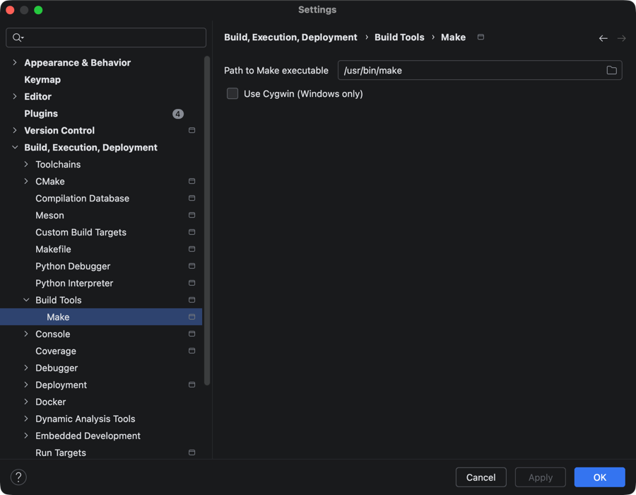
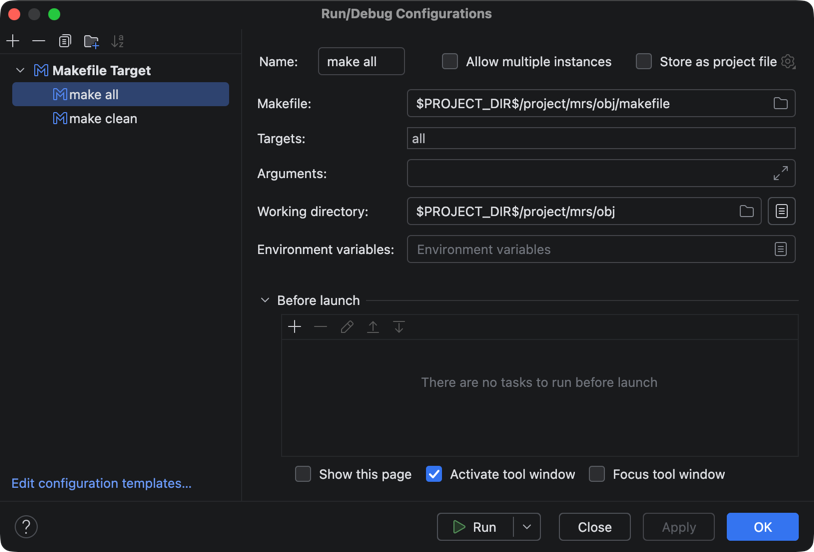

# 在 Clion 中配置 CH32 RISC-V 工具链

感谢该[文章](https://blog.csdn.net/wu58430/article/details/126548417?spm=1001.2014.3001.5506)给我的启发！

## 环境配置

从[官网](http://www.mounriver.com/download)下载好 MounRiver Studio，
并将下面的工具链路径添加到环境变量中

::: code-group
```shell [Windows]
'C:\MounRiver\MounRiver_Studio\toolchain\OpenOCD\bin'
'C:\MounRiver\MounRiver_Studio\toolchain\RISC-V Embedded GCC\bin'
```

```shell [macOS]
'/Applications/MounRiver Studio 2.app/Contents/Resources/app/resources/darwin/components/WCH/OpenOCD/OpenOCD/bin'
'/Applications/MounRiver Studio 2.app/Contents/Resources/app/resources/darwin/components/WCH/Toolchain/RISC-V Embedded GCC12/bin'
```
:::

## CLion 设置

1. 如图找到Clion设置中的`Make`



2. 将路径改为 MounRiver Studio 自带的 make，其路径地址为：

::: code-group
```shell [Windows]
'C:\MounRiver\MounRiver_Studio\toolchain\Build Tools\bin\make.exe'
```

```shell [macOS]
'/Applications/MounRiver Studio 2.app/Contents/Resources/app/resources/darwin/others/Build_Tools/Make/bin/make'
```
:::

3. 保存并退出设置

## 编译烧录

1. 使用 MounRiver Studio 对工程进行一次成功编译，会发现在工程目录下多了一个 `obj` 文件夹，
其中包含了 `makefile` 和 `subdir.mk` 文件，这是在 Clion 中配置的关键

2. 进入 CLion 中打开该工程文件

3. 在 Clion 中编辑配置，新建 `Makefile Target`，如图填写 `Working Directory` 和 `makefile`。
`Target` 分别填写 `all` 和 `clean`



::: tip 
`make clean` 可以用于清理所有编译的文件，运行一次 `make clean` 再运行 `make all` 可达到重新编译的效果
:::

4. 再新建一个 `OpenOCD Download & Run` 配置，修改 `Debugger` 和 `Board config file` 为以下路径

::: code-group
```shell [Windows]
'C:\MounRiver\MounRiver_Studio\toolchain\RISC-V Embedded GCC\bin\riscv-none-embed-gdb.exe'
'C:\MounRiver\MounRiver_Studio\toolchain\OpenOCD\bin\wch-riscv.cfg'
```

```shell [macOS]
'/Applications/MounRiver Studio 2.app/Contents/Resources/app/resources/darwin/components/WCH/Toolchain/RISC-V Embedded GCC12/bin/riscv-wch-elf-gdb'
'/Applications/MounRiver Studio 2.app/Contents/Resources/app/resources/darwin/components/WCH/OpenOCD/OpenOCD/bin/wch-riscv.cfg
```
:::

5. 在 `Before launch` 内增加运行其他配置，选择前文添加的 `make all` ，这样便会在运行这个配置时自动进行一次编译。

6. 然后就可以通过 Clion 进行编译、下载和调试了！

::: tip 
想要新增文件只需要在加入新文件后，
用 MounRiver Studio 打开这个工程重新进行一次成功的编译即可获得更新后的 `makefile` 和 `subdir.mk` 文件，
便可以继续用 Clion 进行代码编写烧录了。
:::